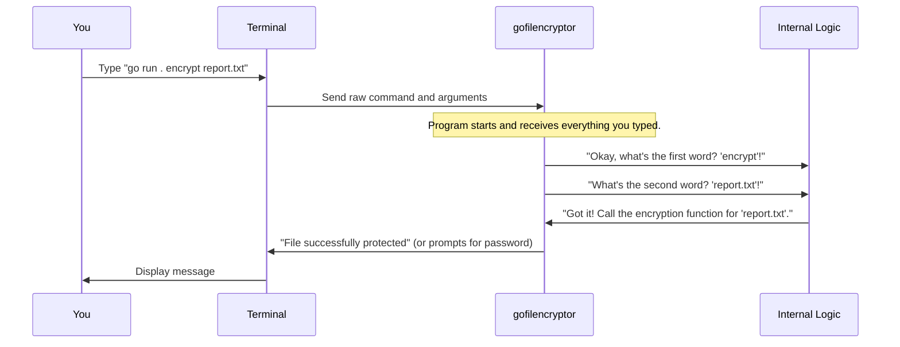

# Chapter 2: Command-Line Interface (CLI)

In the previous chapter, [Application Packaging (Docker)](01_application_packaging__docker__.md), we learned how to package `gofilencryptor` into a neat, portable Docker container. This means you have a ready-to-use tool, just like a pre-built coffee machine. But how do you *tell* that coffee machine to make coffee? You press buttons, right?

Similarly, for `gofilencryptor`, you need a way to tell it what to do. You can't click buttons on it because it doesn't have a visual screen! This is where the **Command-Line Interface (CLI)** comes in.

Our main goal in this chapter is to understand: **How do we "talk" to `gofilencryptor` directly using text commands to make it encrypt or decrypt files?**

### What is a Command-Line Interface (CLI)?

Imagine your computer's operating system (like Windows, macOS, or Linux) has a hidden "control panel" where instead of clicking icons, you type instructions. This "control panel" is called the **terminal** or **command prompt**, and the way you interact with programs there is through a **Command-Line Interface (CLI)**.

Think of it like giving a robot instructions by typing:

*   "Robot, walk forward 5 steps!"
*   "Robot, pick up the red ball!"

For `gofilencryptor`, it's similar:

*   "Hey `gofilencryptor`, `encrypt` this file: `my_secret_doc.txt`!"
*   "Hey `gofilencryptor`, `decrypt` that file: `my_secret_doc.txt.gfe`!"

A CLI is a powerful way to interact with programs directly using text. It's often faster for repetitive tasks and can be easily automated.

### Key Parts of a CLI Command

Every command you type into the terminal usually has a few main ingredients:

1.  **The Program Name**: This is the name of the tool you want to use (e.g., `gofilencryptor` or `main` if you're running it with `go run .`).
2.  **The Command/Action**: This tells the program *what* to do. It's like the "verb" in your instruction. For `gofilencryptor`, these are `encrypt`, `decrypt`, or `help`.
3.  **Arguments/Details**: These are extra pieces of information the program needs to complete the action. It's like the "noun" or "object" of your verb. For `gofilencryptor`, this is usually the file path (e.g., `/path/to/your/file`).

Let's see this visually:

| Part of Command   | Example for `gofilencryptor`       | What it Means                                  |
| :---------------- | :--------------------------------- | :--------------------------------------------- |
| **Program Name**  | `go run .` (or `docker run ... go-file-encryptor`) | "I want to use the `gofilencryptor` tool."     |
| **Command/Action** | `encrypt`                          | "I want to *encrypt* something."               |
| **Argument/Detail** | `/path/to/my_file.txt`             | "The thing I want to encrypt is `my_file.txt`." |

### Using the CLI with `gofilencryptor`

Let's try "talking" to `gofilencryptor` using its CLI. Remember, you can run `gofilencryptor` in two main ways: directly (if you have Go installed) or using Docker. The commands you give to `gofilencryptor` are the same, no matter how you launch it.

#### 1. Running Directly (with Go installed)

If you have Go installed, you can launch `gofilencryptor` from its source code using `go run .`.

**Example 1: Encrypting a File**

Imagine you have a file named `report.txt` in your current folder. To encrypt it, you'd type:

```sh
go run . encrypt report.txt
```

**What happens:**

*   `go run .`: This launches the `gofilencryptor` program.
*   `encrypt`: This is the command, telling `gofilencryptor` to encrypt a file.
*   `report.txt`: This is the argument, telling `gofilencryptor` *which* file to encrypt.

After you press Enter, `gofilencryptor` will prompt you to "Enter password" twice. Type your password (it won't show on screen for security), press Enter, and then type it again. If passwords match, you'll see:

```
Enter password: 
Confirm password: 

Encrypting...

File successfully protected
```

A new encrypted file, `report.txt.gfe`, will appear in the same folder.

**Example 2: Decrypting a File**

Now, let's decrypt the `report.txt.gfe` file:

```sh
go run . decrypt report.txt.gfe
```

**What happens:**

*   `decrypt`: This command tells `gofilencryptor` to decrypt.
*   `report.txt.gfe`: This is the argument, the file to decrypt.

You'll be prompted for the password. Enter the correct password, and you'll see:

```
Enter password: 

Decrypting...

File successfully decrypted.
```

The original `report.txt` will be restored, and `report.txt.gfe` will be removed.

**Example 3: Getting Help**

If you forget the commands, just ask `gofilencryptor` for help:

```sh
go run . help
```

You'll get a helpful message explaining how to use the tool:

```
CryptoGo
Simple file encrypter for your day-to-day needs.

Usage:

	CryptoGo encrypt /path/to/your/file

Commands:

	 encrypt		Encrypts a file given a password
	 decrypt		Tries to decrypt a file using a password
	 help		Displays help text
```

#### 2. Running with Docker

As we saw in [Chapter 1](01_application_packaging__docker__.md), you can also run `gofilencryptor` inside a Docker container. The key difference is how you launch the program. You use `docker run`, and then pass the `gofilencryptor` commands and arguments to the container.

```sh
docker run -v /Users/yourname/Documents/Secrets:/app/files \
  go-file-encryptor encrypt /app/files/my_secret_doc.txt
```

Here, `encrypt /app/files/my_secret_doc.txt` are the CLI commands being sent to the `go-file-encryptor` program *inside* the Docker container. Everything else is about setting up the Docker environment.

### How the CLI Works Internally

When you type a command like `go run . encrypt report.txt`, what happens inside `gofilencryptor`?

Let's trace the journey of your command:



Essentially, `gofilencryptor` is designed to "read" the words you type after its name and figure out what to do based on those words.

#### Peeking into the Code (`main.go`)

Let's look at how `gofilencryptor` (written in Go) understands your commands. It uses a special feature of Go programs called `os.Args`.

When you run a Go program from the command line, the `os.Args` variable automatically stores everything you typed, broken down into separate "words" or "arguments."

*   `os.Args[0]` is always the name of the program itself (or how it was launched, like `main`).
*   `os.Args[1]` is the *first* word after the program name (which is usually your command like `encrypt` or `decrypt`).
*   `os.Args[2]` is the *second* word, and so on (which is usually your file path).

Here's a simplified look at the `main.go` file:

```go
package main

import (
	"fmt"
	"os" // We need the 'os' package to access os.Args
	// ... other imports ...
)

func main() {
	// Check if any command was given (e.g., just "go run ." without "encrypt")
	if len(os.Args) < 2 {
		printHelp() // If not, show help
		os.Exit(0)
	}

	// The first "word" after the program name is our command
	function := os.Args[1] 

	// Now, check what that command is
	switch function {
	case "help":
		printHelp() // Call the function to print help text
	case "encrypt":
		encryptHandle() // Call the function to handle encryption
	case "decrypt":
		decryptHandle() // Call the function to handle decryption
	default:
		// If the command is not recognized
		fmt.Println("Run CryptoGo encrypt to encrypt a file, and CryptoGo decrypt to decrypt a file.")
		os.Exit(1)
	}
}

// encryptHandle function (simplified)
func encryptHandle() {
	// Check if a file path was provided after "encrypt"
	if len(os.Args) < 3 { 
		println("Missing the path to the file. For more information run CryptoGo help")
		os.Exit(0)
	}
	
	// The second "word" after the program name is our file path
	file := os.Args[2] 
	
	// ... rest of the encryption logic (password prompt, file operations) ...
	fmt.Println("\nEncrypting...")
	// filecrypt.Encrypt(file, password) // This is where the actual encryption happens!
	fmt.Println("\nFile successfully protected")
}

// ... decryptHandle() and printHelp() functions are similar ...
```

**Explanation of the Code Snippets:**

*   `import "os"`: This line tells Go that our program will use features from the `os` (operating system) package, which includes `os.Args`.
*   `if len(os.Args) < 2`: This checks if the user provided at least one command after `go run .`. `len(os.Args)` tells us how many "words" were typed. If it's less than 2, it means only the program name was given, so `gofilencryptor` shows the `help` message.
*   `function := os.Args[1]`: This line *reads* the command (like "encrypt" or "decrypt") that the user typed. Remember, `os.Args[0]` is the program name, so `os.Args[1]` is the first actual command.
*   `switch function`: This is like a "choose your own adventure" path. Based on what `function` (`os.Args[1]`) is, the program jumps to a specific part of the code (`printHelp()`, `encryptHandle()`, or `decryptHandle()`).
*   `file := os.Args[2]`: Inside `encryptHandle()` and `decryptHandle()`, this line reads the file path. Since the command (like "encrypt") is `os.Args[1]`, the file path comes next as `os.Args[2]`.

This structure allows `gofilencryptor` to be flexible and respond to different instructions you give it through the command line.

### Conclusion

In this chapter, you've learned that the **Command-Line Interface (CLI)** is how you interact with `gofilencryptor` using simple text commands. You now understand that these commands have "action words" (like `encrypt` or `decrypt`) and "details" (like the file path) that `gofilencryptor` cleverly "reads" using `os.Args` to perform its tasks.

This CLI is powerful because it allows `gofilencryptor` to receive instructions on *what* to do and *which* file to do it to. But how does `gofilencryptor` actually *find* that file on your computer and then *read* or *write* to it? That's what we'll explore in the next chapter: [File System Interaction](03_file_system_interaction_.md).

---
