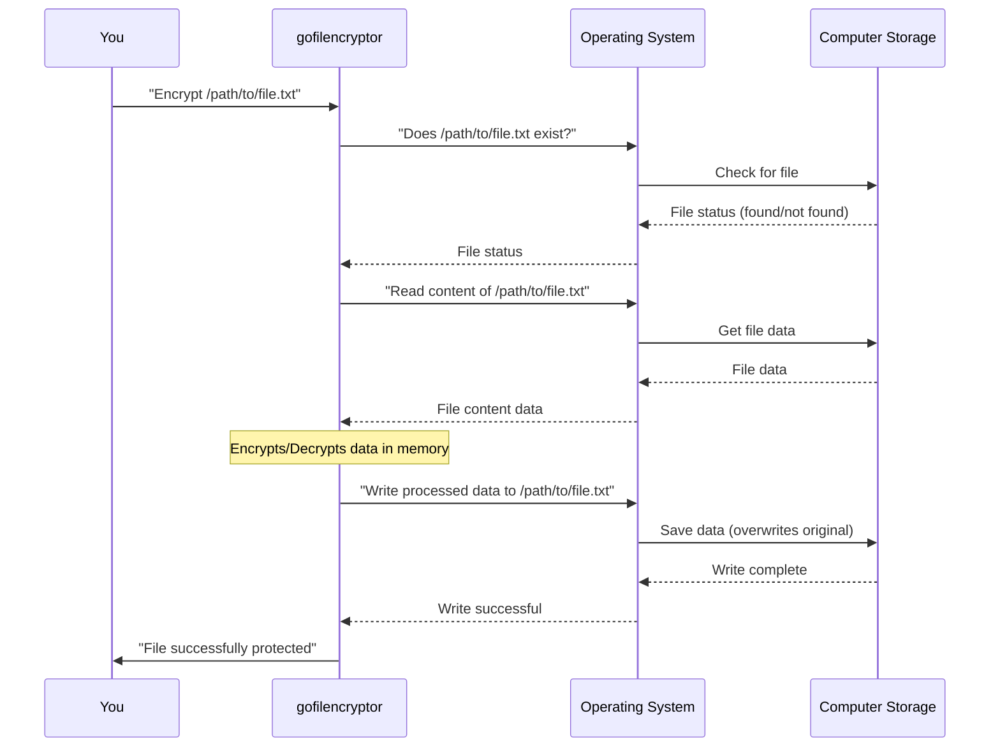

# Chapter 2: File System Interaction

In the previous chapter, [Command-Line Interface (CLI)](01_command_line_interface__cli__.md), we learned how to "talk" to `gofilencryptor` using text commands like `encrypt` and `decrypt`, and how it understands *what* to do and *which* file to act upon. But knowing *what* file to process is just the first step. How does `gofilencryptor` actually reach out and touch that file on your computer?

Our main goal in this chapter is to understand: **How does `gofilencryptor` read data from a file on your computer and then write new data back to your computer's storage?**

### What is File System Interaction?

Imagine your computer's storage (like its hard drive or SSD) is a giant filing cabinet. Each file is like a document in a specific folder. For `gofilencryptor` to work its magic, it needs to:

1.  **Open the right cabinet drawer**: Locate the file you specified by its path (e.g., `/Users/yourname/Documents/Secrets/my_secret_doc.txt`).
2.  **Retrieve the document**: Read all the information from that file.
3.  **Process the document**: Encrypt or decrypt its contents.
4.  **Put the document back (or a new one)**: Write the processed information back to the same file, or sometimes create a new file.

This entire process of finding, reading, and writing files is what we call **File System Interaction**. It's how `gofilencryptor`'s "hands" work with your computer's storage.

### Key Actions in File System Interaction

For `gofilencryptor`, there are three main actions when dealing with files:

*   **Checking if a file exists**: Before trying to read or write, it's a good idea to make sure the file actually exists where you say it does.
*   **Reading a file**: This means getting all the data (like text, images, or anything else) from an existing file into the application's memory so it can work with it.
*   **Writing a file**: This means taking processed data from the application's memory and saving it back to your computer's storage, usually by creating a new file or overwriting an existing one.

### Using File System Interaction in `gofilencryptor`

Let's see how `gofilencryptor` uses these actions when you ask it to encrypt or decrypt a file.

**Scenario: Encrypting a file**

When you run a command like:

```sh
go run . encrypt report.txt
```

Here's what `gofilencryptor` does concerning File System Interaction:

1.  **Checks existence**: It first makes sure `report.txt` is actually there. If not, it stops and tells you the file wasn't found.
2.  **Reads data**: If `report.txt` exists, `gofilencryptor` opens it and reads all its content. This content is temporarily held in the computer's memory.
3.  **Processes data**: (This is where the actual encryption happens, which we'll cover in future chapters like [File Encryption/Decryption Core](04_file_encryption_decryption_core_.md)).
4.  **Writes data back**: After encryption, `gofilencryptor` takes the encrypted content and writes it *back into the original `report.txt` file*. This means the original `report.txt` is overwritten with its encrypted version.

**Scenario: Decrypting a file**

Similarly, when you run:

```sh
go run . decrypt report.txt
```

`gofilencryptor` performs these steps:

1.  **Checks existence**: It checks if `report.txt` exists. (Note: `gofilencryptor` expects the encrypted file to have the original name after encryption, as it overwrites the source file).
2.  **Reads data**: It reads the encrypted content from `report.txt`.
3.  **Processes data**: (This is where decryption happens).
4.  **Writes data back**: It writes the decrypted (original) content *back into the `report.txt` file*, overwriting the encrypted version and restoring the file.

### How File System Interaction Works Internally

When you tell `gofilencryptor` to encrypt or decrypt a file, here's a simplified sequence of events for how it talks to your computer's operating system (OS) to handle the file:



This diagram shows how `gofilencryptor` acts as an intermediary, asking the Operating System to perform actions on files stored on your computer.

#### Peeking into the Code (`main.go` and `filecrypt/filecrypt.go`)

Let's look at the actual code that handles these file system interactions. Go's standard library provides excellent tools for this, primarily through the `os` and `io/ioutil` packages.

**1. Checking if a file exists (`validateFile` in `main.go`)**

Before doing anything, `gofilencryptor` calls a function named `validateFile` to ensure the file path you provided actually points to a real file.

```go
// From main.go

import (
	"os" // We need the 'os' package for os.Stat
	// ... other imports ...
)

func validateFile(file string) bool {
	// os.Stat gets information about the file or folder.
	// If it doesn't exist, os.IsNotExist(err) will be true.
	if _, err := os.Stat(file); os.IsNotExist(err) {
		return false // File not found!
	}
	return true // File exists!
}
```

*   `import "os"`: This line brings in the `os` package, which gives us tools to interact with the operating system, including files.
*   `os.Stat(file)`: This is the key function. It tries to get information (like size, last modified date, etc.) about the file at the given `file` path.
*   `os.IsNotExist(err)`: If `os.Stat` encounters an error, this helper function checks if the error specifically means "file not found." If it is, we return `false` from `validateFile`.

**2. Reading a file (`filecrypt/filecrypt.go`)**

Once `gofilencryptor` knows the file exists, it needs to read its contents.

```go
// From filecrypt/filecrypt.go (simplified)

import (
	"io/ioutil" // We need this for ReadFile
	"os"        // Used for os.Stat and error checking
	// ... other imports ...
)

func Encrypt(source string, password []byte) {
	// ... validation check (same as validateFile) ...
	if _, err := os.Stat(source); os.IsNotExist(err) {
		panic(err.Error()) // Stop if file not found
	}

	// Read all content from the 'source' file into 'plaintext' (as bytes)
	plaintext, err := ioutil.ReadFile(source)
	if err != nil {
		panic(err.Error()) // Handle any other read errors
	}

	// ... encryption magic happens here with 'plaintext' ...
}

func Decrypt(source string, password []byte) {
	// ... validation check ...

	// Read all content from the 'source' file into 'ciphertext'
	ciphertext, err := ioutil.ReadFile(source)
	if err != nil {
		panic(err.Error())
	}

	// ... decryption magic happens here with 'ciphertext' ...
}
```

*   `import "io/ioutil"`: This package provides convenient functions for input/output operations, like reading entire files.
*   `ioutil.ReadFile(source)`: This powerful function reads *all* the bytes from the file specified by `source` and returns them as a `[]byte` (a slice of bytes). If anything goes wrong during reading (e.g., permission issues), it returns an error.

**3. Writing a file (`filecrypt/filecrypt.go`)**

After encryption or decryption, the processed data needs to be saved back. `gofilencryptor` overwrites the original file with the new content.

```go
// From filecrypt/filecrypt.go (simplified)

import (
	"bytes" // To treat byte slice as something that can be copied
	"io"    // We need io.Copy
	"os"    // We need os.Create
	// ... other imports ...
)

func Encrypt(source string, password []byte) {
	// ... (code to read plaintext and encrypt it into 'ciphertext' omitted) ...
	// (assume 'ciphertext' now holds the encrypted data)

	// Create/Open the file for writing. If it exists, it will be truncated (emptied).
	f, err := os.Create(source)
	if err != nil {
		panic(err.Error()) // Handle errors if file cannot be created/opened
	}
	defer f.Close() // IMPORTANT: Always close files when done!

	// Write the 'ciphertext' (encrypted data) to the file 'f'.
	// bytes.NewReader makes our byte slice look like something io.Copy can read from.
	_, err = io.Copy(f, bytes.NewReader(ciphertext))
	if err != nil {
		panic(err.Error()) // Handle errors during writing
	}
}

func Decrypt(source string, password []byte) {
	// ... (code to read ciphertext and decrypt it into 'plaintext' omitted) ...
	// (assume 'plaintext' now holds the decrypted data)

	// Create/Open the file for writing (overwriting if it exists)
	f, err := os.Create(source)
	if err != nil {
		panic(err.Error())
	}
	defer f.Close() // Always close files!

	// Write the 'plaintext' (decrypted data) to the file 'f'.
	_, err = io.Copy(f, bytes.NewReader(plaintext))
	if err != nil {
		panic(err.Error())
	}
}
```

*   `os.Create(source)`: This function is key for writing. It tries to create a new file at the `source` path. If a file *already exists* at that path, `os.Create` will *truncate* it (make it empty) before writing, effectively overwriting its content. It returns a `*os.File` object (`f`), which represents the open file.
*   `defer f.Close()`: This is very important! It ensures that the file (`f`) is properly closed when the function finishes, even if errors occur. Not closing files can lead to data loss or corruption.
*   `bytes.NewReader(ciphertext)`: Our encrypted/decrypted data is in a `[]byte` format. `io.Copy` expects something it can "read from." `bytes.NewReader` converts our byte slice into something `io.Copy` can handle.
*   `io.Copy(f, bytes.NewReader(ciphertext))`: This is the workhorse for writing. It efficiently copies all the data from `bytes.NewReader(ciphertext)` (our processed data) into the file `f`.

These functions from Go's standard library are the `gofilencryptor`'s "hands" that allow it to interact directly with your computer's filing cabinet.

### Conclusion

In this chapter, we explored **File System Interaction**, understanding how `gofilencryptor` manages to read your secret documents and write back their protected (or restored) versions. We saw how it uses commands like `os.Stat` to check for files, `ioutil.ReadFile` to grab all the data, and `os.Create` along with `io.Copy` to save the processed information back to your computer. This fundamental ability to work with files on your disk is crucial for `gofilencryptor`'s operation.

Next, we'll shift our focus to an equally important aspect: how `gofilencryptor` handles your sensitive **passwords** safely. This is covered in [Secure User Input Handling](03_secure_user_input_handling_.md).

---
