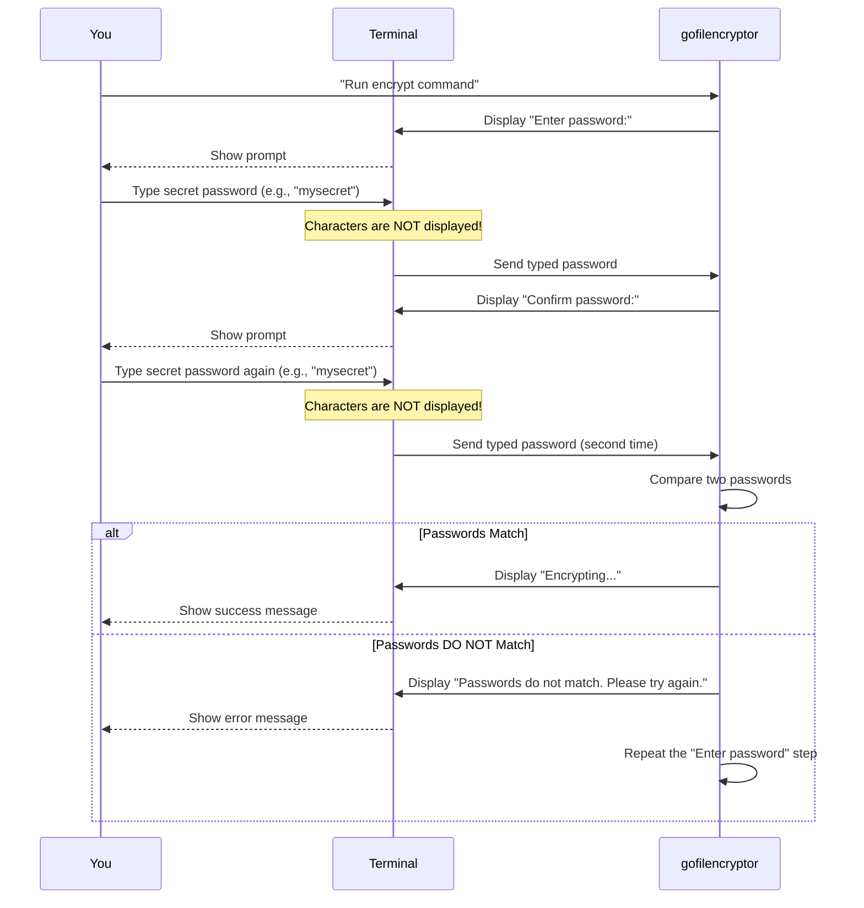

# Chapter 3: Secure User Input Handling

In the previous chapter, [File System Interaction](02_file_system_interaction_.md), we learned how `gofilencryptor` can find and access your files on the computer's storage. It's like `gofilencryptor` now has "hands" to pick up your documents. But what about your most important secret: your password? How does `gofilencryptor` safely get your password without anyone else seeing it, even if they're looking over your shoulder?

Our main goal in this chapter is to understand: **How does `gofilencryptor` allow you to type your secret password without showing it on screen, and how does it make sure you typed it correctly?**

### What is Secure User Input Handling?

When you type a password into a website or an app, you usually see dots or asterisks (`*****`) instead of the actual characters. This is a basic form of **secure user input handling**. It's designed to protect sensitive information like your password from being accidentally seen by others.

`gofilencryptor` takes this a step further: when you type your password, you won't even see dots or asterisks – **nothing** will appear on the screen! It's like a private "whisper" channel where you type your secret, and the application listens without displaying anything.

Additionally, to prevent you from making a typo and accidentally encrypting your file with the wrong password (which would be very bad!), `gofilencryptor` uses a **double-check mechanism**. It asks you to type your password twice, just to be sure. Only if both entries match will it proceed.

### Key Concepts for Secure Passwords

For `gofilencryptor` to handle your password securely, it focuses on two main ideas:

*   **Invisible Input**: When you type your password, the characters are not echoed (displayed) on your screen. This means no one can peek at your password as you type it.
*   **Password Confirmation**: You enter your password twice. `gofilencryptor` compares the two entries. If they are exactly the same, it means you likely typed it correctly. If they don't match, it tells you and asks you to try again.

### Using Secure User Input in `gofilencryptor`

You don't need to do anything special to use this secure input feature; `gofilencryptor` handles it automatically whenever it needs your password. Let's see it in action.

When you run an `encrypt` command:

```sh
go run . encrypt my_secret_file.txt
```

You will see prompts like this in your terminal:

```
Enter password: 
Confirm password: 
```

**What happens:**

1.  **"Enter password:"**: When this prompt appears, you start typing your password. **Crucially, as you type, you will not see any characters, dots, or asterisks appear on the screen.** Just type your password and press `Enter`.
2.  **"Confirm password:"**: After you press `Enter`, a second prompt appears. Type your password **again**, exactly as you did the first time, and press `Enter`.
3.  **Validation**: `gofilencryptor` then compares the two passwords you typed.
    *   If they match, it will continue with the encryption process (e.g., "Encrypting..." message).
    *   If they *don't* match, you'll see a message like "Passwords do not match. Please try again." and it will prompt you to "Enter password:" again from the beginning, until you enter matching passwords.

The same process happens when you use the `decrypt` command, though you'll only be asked for the password once since there's no need to confirm for decryption.

```sh
go run . decrypt my_secret_file.txt
```

You'll see:

```
Enter password: 
```

Again, no characters will appear as you type.

### How Secure User Input Works Internally

When `gofilencryptor` asks for your password, a special process takes place to ensure security and validation.

Here's a simplified sequence of events:



This diagram shows how `gofilencryptor` interacts with your terminal to get the input without showing it and then performs the critical comparison.

#### Peeking into the Code (`main.go`)

Let's look at the actual Go code in `main.go` that handles this secure input. It uses a special library function `terminal.ReadPassword` and the `bytes.Equal` function for comparison.

**1. Getting the Password (`getPassword` function)**

The `getPassword` function is responsible for prompting you, reading your hidden input, and then confirming it.

```go
// From main.go

import (
	"fmt"
	"bytes" // Needed for comparing passwords (which are byte slices)
	"golang.org/x/crypto/ssh/terminal" // For secure password input
)

func getPassword() []byte {
	fmt.Print("Enter password: ")
	// terminal.ReadPassword(0) reads from standard input (0)
	// without echoing characters to the screen.
	password, _ := terminal.ReadPassword(0) 

	fmt.Print("\nConfirm password: ")
	password2, _ := terminal.ReadPassword(0) // Read the confirmation password

	// Call validatePassword to check if they match
	if !validatePassword(password, password2) {
		fmt.Print("\nPasswords do not match. Please try again.\n")
		// If passwords don't match, this function calls itself again!
		// It will keep asking until you enter matching passwords.
		return getPassword() 
	}
	return password // Return the securely entered password
}
```

*   `import "golang.org/x/crypto/ssh/terminal"`: This line brings in a special Go package that provides the `terminal.ReadPassword` function. This function is designed exactly for reading sensitive input like passwords without showing it on the screen.
*   `password, _ := terminal.ReadPassword(0)`: This is the magic line! When executed, it tells your terminal to hide characters as you type. It waits for you to type and press Enter, then it returns all the characters you typed as a `[]byte` (a sequence of bytes). The `0` indicates that it reads from the standard input (your keyboard).
*   `return getPassword()`: This is an example of **recursion**. If the passwords don't match, the `getPassword` function calls *itself* again, starting the whole process over (asking for password, then confirmation) until you get it right. This ensures `gofilencryptor` always gets a confirmed password.

**2. Validating the Password (`validatePassword` function)**

This is a simpler helper function that just checks if the two byte slices (your passwords) are identical.

```go
// From main.go

import (
	"bytes" // Needed for bytes.Equal
)

func validatePassword(password1 []byte, password2 []byte) bool {
	// bytes.Equal is a safe way to compare two byte slices.
	// It returns true if they contain the exact same sequence of bytes.
	if !bytes.Equal(password1, password2) {
		return false // Passwords are not the same
	}

	return true // Passwords match!
}
```

*   `import "bytes"`: This package provides utility functions for working with byte slices.
*   `bytes.Equal(password1, password2)`: This function is crucial for securely comparing the two passwords. Instead of directly comparing them with `==` (which doesn't work reliably for slices in Go), `bytes.Equal` correctly checks if every byte in `password1` is the same as the corresponding byte in `password2`. This ensures a precise match before `gofilencryptor` proceeds.

These two functions (`getPassword` and `validatePassword`) work together to create the secure and robust password input system for `gofilencryptor`.

### Conclusion

In this chapter, you've learned about **Secure User Input Handling**, a critical component of `gofilencryptor`. You now understand that your password is kept private by not appearing on the screen, thanks to functions like `terminal.ReadPassword`, and that it's double-checked for accuracy using `bytes.Equal` before being used. This ensures that your secret remains a secret and that you don't accidentally lock yourself out of your encrypted files.

With your password securely entered, the next step for `gofilencryptor` is to actually use it to scramble (encrypt) or unscramble (decrypt) your file's data. That's what we'll explore in the next chapter: [File Encryption/Decryption Core](04_file_encryption_decryption_core_.md).

---
