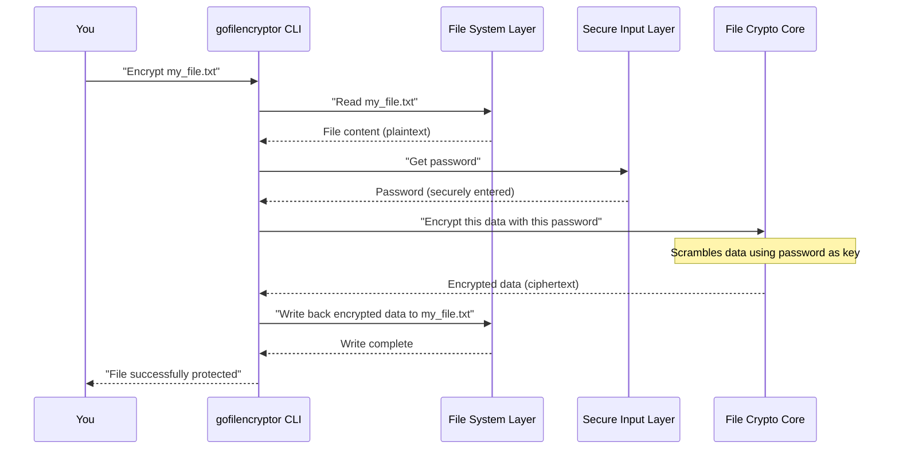

# Chapter 4: File Encryption/Decryption Core

In the previous chapter, [Secure User Input Handling](03_secure_user_input_handling_.md), we learned how `gofilencryptor` safely gets your secret password without showing it on screen and how it double-checks your typing. Now that `gofilencryptor` has your password (your secret key to the lock!), it's time for the real magic: turning your readable files into scrambled secrets, and turning those secrets back into readable files.

Our main goal in this chapter is to understand: **How does `gofilencryptor` actually scramble (encrypt) and unscramble (decrypt) the contents of your files using your password?**

### What is the File Encryption/Decryption Core?

Imagine you have a very special, high-tech safe. This safe can take your important documents and, with a secret code, mix them up into an unreadable mess that looks like random gibberish. Only someone with the exact same secret code can then put the documents back into their original, readable form.

The **File Encryption/Decryption Core** in `gofilencryptor` is like that special safe. It's the central brain of the application that performs the actual process of securing and unlocking your data.

*   **Encryption**: It takes your normal, readable file (called "plaintext") and, using a secret key derived from your password, transforms it into a jumbled, unreadable mess (called "ciphertext").
*   **Decryption**: It takes that jumbled, unreadable mess (the "ciphertext") and, using the *exact same* secret key, reverts it back to its original, readable state (the "plaintext").

Without this core component, `gofilencryptor` would just be a program that reads files and asks for passwords, but couldn't actually protect your data!

### Key Concepts: Scrambling and Unscrambling

To understand the core, let's break down the main ideas:

*   **Plaintext**: This is your original, easy-to-read data. Think of it as your diary entries, private photos, or important financial reports *before* they are secured.
*   **Ciphertext**: This is the jumbled, unreadable version of your data *after* it has been encrypted. If someone sees ciphertext without the key, it looks like nonsense.
*   **Key**: This is the secret ingredient derived from your password. It's like the unique pattern of the safe's lock. The same key is used for both encrypting and decrypting. If the key is wrong, the data stays jumbled!
*   **Algorithm**: This is the step-by-step mathematical process used for scrambling and unscrambling. `gofilencryptor` uses a very strong and widely trusted algorithm called **AES-GCM**, which we'll explore in more detail in [Authenticated Encryption (AES-GCM)](06_authenticated_encryption__aes_gcm__.md).

### Using the File Encryption/Decryption Core

As a user, you don't directly "call" the encryption or decryption core. Instead, you interact with `gofilencryptor` through its [Command-Line Interface (CLI)](01_command_line_interface__cli__.md). When you type `encrypt` or `decrypt` commands, the application's other parts ([File System Interaction](02_file_system_interaction_.md) and [Secure User Input Handling](03_secure_user_input_handling_.md)) prepare everything, and *then* they hand off the data and the password to this core component.

For example, when you run:

```sh
go run . encrypt my_secret_file.txt
```

1.  `gofilencryptor` uses [File System Interaction](02_file_system_interaction_.md) to read `my_secret_file.txt`.
2.  `gofilencryptor` uses [Secure User Input Handling](03_file_system_interaction_.md) to get your password.
3.  Then, it passes the file's content (plaintext) and your password to the **File Encryption/Decryption Core**.
4.  The core performs the scrambling, and the encrypted data is passed back.
5.  Finally, [File System Interaction](02_file_system_interaction_.md) saves the scrambled data back to `my_secret_file.txt`, overwriting the original.

The same general steps apply for decryption, just in reverse.

### How the File Encryption/Decryption Core Works Internally

When `gofilencryptor` needs to encrypt or decrypt, here's a simplified flow of how the core interacts with the rest of the application:



For decryption, the process is very similar, but the "File Crypto Core" would receive ciphertext and return plaintext.

#### Peeking into the Code (`filecrypt/filecrypt.go`)

The actual encryption and decryption logic resides in the `filecrypt/filecrypt.go` file. It uses advanced cryptographic tools from Go's standard library. Don't worry if some terms seem complicated; we'll explain them in later chapters. For now, focus on what each piece *does*.

**1. The `Encrypt` Function (Simplified)**

This function takes the path to your `source` file and your `password` (which is already securely obtained).

```go
// From filecrypt/filecrypt.go

import (
	"crypto/aes"     // For the AES encryption algorithm
	"crypto/cipher"  // For advanced encryption modes like GCM
	"crypto/rand"    // To generate random numbers for 'nonce'
	"io"             // For reading random data
	"io/ioutil"      // To read file content (Chapter 3)
	"os"             // For file operations (Chapter 3)
	"bytes"          // To treat data as something that can be copied (Chapter 3)
	// ... other imports for key derivation ...
)

func Encrypt(source string, password []byte) {
	// 1. Read the original file's content (plaintext)
	plaintext, err := ioutil.ReadFile(source)
	if err != nil { /* handle error */ }

	// 2. Prepare a unique, random "nonce" (a "number used once")
	// This helps make each encryption unique, even with the same password.
	nonce := make([]byte, 12) // Nonce for AES-GCM is usually 12 bytes
	if _, err := io.ReadFull(rand.Reader, nonce); err != nil { /* handle error */ }

	// 3. Derive a strong cryptographic key ('dk') from your password and the nonce.
	// This is crucial! Your actual password isn't used directly as the key.
	// We'll dive deep into this process in Chapter 6!
	// dk := pbkdf2.Key(password, nonce, 4096, 32, sha256.New) // (Full detail in Chapter 6)

	// --- Core Encryption Steps ---

	// 4. Create the AES "lock" (block cipher) using the derived key.
	block, err := aes.NewCipher(dk) // Assume 'dk' is available here
	if err != nil { /* handle error */ }

	// 5. Prepare the AES-GCM mechanism (a super secure way to use AES).
	// We'll learn more about AES-GCM in Chapter 7!
	aesgcm, err := cipher.NewGCM(block)
	if err != nil { /* handle error */ }

	// 6. Perform the actual encryption!
	// 'aesgcm.Seal' takes your plaintext and scrambles it using the key and nonce.
	ciphertext := aesgcm.Seal(nil, nonce, plaintext, nil) 

	// 7. Attach the nonce to the end of the encrypted data.
	// We need this nonce later to decrypt the file correctly.
	ciphertext = append(ciphertext, nonce...) 

	// 8. Write the encrypted data (ciphertext) back to the original file.
	f, err := os.Create(source) // This overwrites the original file!
	if err != nil { /* handle error */ }
	defer f.Close() // Important: always close files!
	_, err = io.Copy(f, bytes.NewReader(ciphertext))
	if err != nil { /* handle error */ }
}
```

**Explanation of Encrypt Core Snippets:**

*   `nonce := make([]byte, 12)` and `io.ReadFull(rand.Reader, nonce)`: This generates a random, unique `nonce` (think of it as a unique "flavor" added to each encryption). This `nonce` is crucial for security.
*   `block, err := aes.NewCipher(dk)`: This creates an **AES cipher block**. AES (Advanced Encryption Standard) is the strong encryption algorithm. `dk` is the **derived key** (from your password and the nonce) which acts as the secret ingredient for this AES "lock."
*   `aesgcm, err := cipher.NewGCM(block)`: This prepares the **GCM (Galois/Counter Mode)**. AES-GCM is a highly secure and recommended way to perform modern encryption. We'll explore why it's so good in [Authenticated Encryption (AES-GCM)](07_authenticated_encryption__aes_gcm__.md).
*   `ciphertext := aesgcm.Seal(nil, nonce, plaintext, nil)`: This is the main line that performs the encryption! It takes your original `plaintext`, the `nonce`, and uses the `aesgcm` mechanism to produce the `ciphertext` (your scrambled data).
*   `ciphertext = append(ciphertext, nonce...)`: After encryption, the `nonce` is attached to the very end of the `ciphertext`. This is a common practice so that when you decrypt, you can easily retrieve the correct `nonce` needed for unscrambling.

**2. The `Decrypt` Function (Simplified)**

This function takes the path to your `source` file (which now contains ciphertext) and your `password`.

```go
// From filecrypt/filecrypt.go

import (
	"crypto/aes"     
	"crypto/cipher"  
	"encoding/hex"   // To convert salt to hex and back
	"io/ioutil"      // To read file content (Chapter 3)
	"os"             // For file operations (Chapter 3)
	"bytes"          // To treat data as something that can be copied (Chapter 3)
	// ... other imports for key derivation ...
)

func Decrypt(source string, password []byte) {
	// 1. Read the encrypted file's content (ciphertext)
	ciphertext, err := ioutil.ReadFile(source)
	if err != nil { /* handle error */ }

	// 2. Extract the 'nonce' from the end of the ciphertext.
	// Remember, we put it there during encryption!
	salt := ciphertext[len(ciphertext)-12:]
	// The nonce needs to be decoded from string format if it was encoded.
	// (In our specific code, it's directly extracted from a byte slice, so hex conversion is just for demonstration if needed, but the core extracts directly).
	// nonce, err := hex.DecodeString(hex.EncodeToString(salt)) // Simplified for direct use of 'salt' as 'nonce'
	nonce := salt // Use the extracted 'salt' directly as the 'nonce'

	// 3. Derive the exact same strong cryptographic key ('dk') as used for encryption.
	// It uses your password and the extracted nonce. If this key isn't identical,
	// decryption will fail! Chapter 6 explains this.
	// dk := pbkdf2.Key(password, nonce, 4096, 32, sha256.New) // (Full detail in Chapter 6)

	// --- Core Decryption Steps ---

	// 4. Create the AES "lock" using the derived key.
	block, err := aes.NewCipher(dk) // Assume 'dk' is available here
	if err != nil { /* handle error */ }

	// 5. Prepare the AES-GCM mechanism for decryption.
	aesgcm, err := cipher.NewGCM(block)
	if err != nil { /* handle error */ }

	// 6. Perform the actual decryption!
	// 'aesgcm.Open' takes the encrypted data (excluding the nonce at the end),
	// the nonce, and tries to unscramble it using the AES-GCM lock.
	// If the password/key is wrong, or data is tampered, this will fail.
	plaintext, err := aesgcm.Open(nil, nonce, ciphertext[:len(ciphertext)-12], nil) 
	if err != nil { /* handle error - likely wrong password or corrupt file */ }

	// 7. Write the decrypted data (plaintext) back to the original file.
	f, err := os.Create(source) // This overwrites the encrypted file!
	if err != nil { /* handle error */ }
	defer f.Close() // Important: always close files!
	_, err = io.Copy(f, bytes.NewReader(plaintext))
	if err != nil { /* handle error */ }
}
```

**Explanation of Decrypt Core Snippets:**

*   `salt := ciphertext[len(ciphertext)-12:]`: This retrieves the last 12 bytes of the `ciphertext`, which is where we appended the `nonce` during encryption.
*   `block, err := aes.NewCipher(dk)` and `aesgcm, err := cipher.NewGCM(block)`: These steps are identical to encryption; they prepare the AES-GCM mechanism using the same derived key.
*   `plaintext, err := aesgcm.Open(nil, nonce, ciphertext[:len(ciphertext)-12], nil)`: This is the main line for decryption! It takes the `ciphertext` (but without the `nonce` part), the extracted `nonce`, and uses the `aesgcm` mechanism to try and produce the original `plaintext`. If the `nonce` is wrong, or the derived key (`dk`) is wrong (meaning your password was wrong), or if the encrypted data was tampered with, this step will fail and return an error.

These `Encrypt` and `Decrypt` functions are the heart of `gofilencryptor`, taking your data and transforming it securely.

### Conclusion

In this chapter, we've unraveled the **File Encryption/Decryption Core**, which is the central engine for securing your files in `gofilencryptor`. You now have a high-level understanding of how plaintext is scrambled into ciphertext (encryption) and back again (decryption) using a secret key derived from your password. We also got a first look at the powerful AES-GCM algorithm, which is the "master locksmith" responsible for these transformations.

While we touched upon the key and nonce, we glossed over how they are actually created and used securely. In the next chapter, we'll dive deeper into **Cryptographic Key Derivation**, where you'll learn exactly how your password is turned into that crucial secret key: [Cryptographic Key Derivation](05_cryptographic_key_derivation_.md).

---
