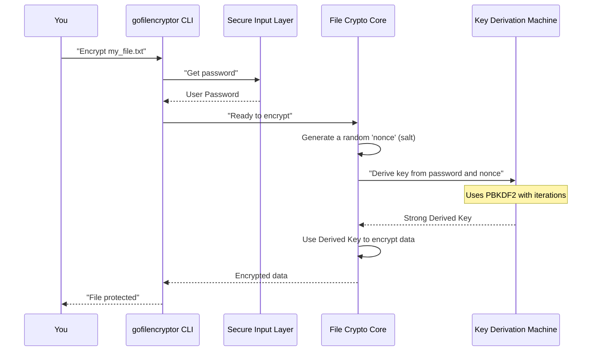

# Chapter 5: Cryptographic Key Derivation

In the previous chapter, [File Encryption/Decryption Core](04_file_encryption_decryption_core_.md), we got a glimpse of how `gofilencryptor` scrambles and unscrambles your files using a secret key. We learned that this "key" is derived from your password. But have you ever wondered why your password isn't used *directly* as the encryption key?

Our main goal in this chapter is to understand: **How does `gofilencryptor` transform your simple, memorable password into a super strong, unique, and highly secure encryption key that's perfect for protecting your files?**

### The Password Problem: Why Not Use It Directly?

Imagine your password is "mysecret123". This is easy for you to remember. But if someone guesses this password, and `gofilencryptor` used it directly as the encryption key, they could easily unlock your files.

Here's the problem:

*   **Weakness:** Passwords are often chosen by humans and can be short, common words, or easy to guess.
*   **Reusability:** If you use the same password for `gofilencryptor` and a less secure website, and that website gets hacked, your `gofilencryptor` files could be at risk too.
*   **Direct Guessing:** Attackers have powerful computers that can try billions of passwords per second. If your password *is* the key, they can try to guess it directly and unlock your data.

This is where **Cryptographic Key Derivation** comes in! It's like a sophisticated key-making machine that takes your simple password as a raw material and, through a complex, time-consuming process, forges a unique, highly random, and strong key. This derived key is what's actually used for encryption.

### What is Cryptographic Key Derivation?

Think of it this way:

*   Your password is like a raw piece of metal you find lying around.
*   The **Key Derivation Function (KDF)** is a high-tech forge.
*   The final, derived key is a finely crafted, unique key, stronger than any raw metal.

A KDF takes your password (and some other ingredients) and puts it through a special, very difficult-to-reverse mathematical blender. The output is a highly random, long string of bits that serves as the actual encryption key. Even if your original password was short, the derived key will be long and complex, making it virtually impossible to guess.

`gofilencryptor` uses a well-known and trusted KDF called **PBKDF2** (Password-Based Key Derivation Function 2).

Let's look at the special "ingredients" PBKDF2 uses:

| Ingredient | What it Is for PBKDF2 | Why it's Important                       |
| :--------- | :-------------------- | :--------------------------------------- |
| **Password** | Your secret phrase (e.g., "mysecret123") | The starting point, easy for *you* to remember. |
| **Salt**   | A random, unique piece of data generated for *each* encryption. In `gofilencryptor`, this is the `nonce` we saw in Chapter 5. | Makes each derived key unique, even if you encrypt two files with the *exact same password*. Prevents attackers from using pre-computed "rainbow tables." |
| **Iterations** | How many times the mathematical process is repeated. `gofilencryptor` uses 4096. | More iterations mean the process takes longer. This intentionally slows down attackers who try to guess passwords millions of times per second. |
| **Key Length** | The desired length of the final, derived key. `gofilencryptor` needs a 32-byte key for AES-256. | A longer key means more possible combinations, making it exponentially harder to guess. |
| **Hashing Algorithm** | The specific mathematical function used inside the process. `gofilencryptor` uses SHA-256. | A strong hashing algorithm ensures the output is very mixed up and unpredictable. |

The most important thing to remember is that PBKDF2 is designed to be **slow** on purpose. It takes a tiny bit of time to derive the key, but that small delay makes it *much harder* for an attacker to try billions of passwords quickly.

### How `gofilencryptor` Uses Key Derivation

As a user, you don't need to do anything special. `gofilencryptor` handles the entire key derivation process automatically in the background.

When you run an `encrypt` or `decrypt` command:

1.  `gofilencryptor` first securely obtains your password using [Secure User Input Handling](03_secure_user_input_handling_.md).
2.  For encryption, it generates a fresh, random `nonce` (which acts as the "salt" for PBKDF2).
3.  Then, it passes your password, this `nonce`, the number of iterations (4096), and the desired key length (32 bytes) to the PBKDF2 function.
4.  PBKDF2 crunches these ingredients and produces the powerful, derived encryption key.
5.  This derived key is then handed over to the [File Encryption/Decryption Core](04_file_encryption_decryption_core_.md) to do the actual scrambling or unscrambling of your file.

This means your raw password is never directly used for encryption, adding a crucial layer of security!

### How Key Derivation Works Internally

Let's visualize how your password goes from a simple string to a robust encryption key:



This diagram shows how `gofilencryptor` acts as an orchestrator, making sure your password goes through the "Key Derivation Machine" before it's used for encryption.

#### Peeking into the Code (`filecrypt/filecrypt.go`)

The actual magic of key derivation happens in the `filecrypt/filecrypt.go` file, specifically using the `pbkdf2.Key` function from Go's `golang.org/x/crypto/pbkdf2` package.

**1. Generating the Salt (Nonce) (for Encryption)**

Remember from Chapter 5, a `nonce` is generated. This `nonce` serves as the `salt` for our key derivation process.

```go
// From filecrypt/filecrypt.go (inside Encrypt function)

import (
	"crypto/rand" // To generate random numbers for 'nonce'
	"io"          // For reading random data
	// ... other imports ...
)

// ... previous code to read plaintext ...

// Create a space for our 12-byte random nonce
nonce := make([]byte, 12) 

// Fill the nonce with truly random data
if _, err := io.ReadFull(rand.Reader, nonce); err != nil {
	panic(err.Error()) // Handle error if random data cannot be read
}

// Now, 'nonce' holds 12 random bytes, which will be our salt.
```

*   `nonce := make([]byte, 12)`: This creates an empty "container" (a byte slice) big enough for 12 bytes.
*   `io.ReadFull(rand.Reader, nonce)`: This line fills our `nonce` container with 12 bytes of high-quality random data. `rand.Reader` is a source of cryptographically secure random numbers provided by Go's standard library. This randomness is crucial for the security of our `salt`.

**2. Deriving the Key (for Encryption and Decryption)**

This is the core line that performs the PBKDF2 magic:

```go
// From filecrypt/filecrypt.go (in both Encrypt and Decrypt functions)

import (
	"crypto/sha256" // For the SHA-256 hashing algorithm
	"golang.org/x/crypto/pbkdf2" // For the PBKDF2 key derivation function
	// ... other imports ...
)

// Assume 'password' (your entered password) and 'nonce' (the salt) are available.

// Call PBKDF2 to derive the strong key
dk := pbkdf2.Key(
	password,       // Your password (raw material)
	nonce,          // The random salt (unique flavor for each key)
	4096,           // Number of iterations (makes it slow for attackers)
	32,             // Desired length of the derived key in bytes (32 bytes = 256 bits)
	sha256.New,     // The hashing algorithm (SHA-256)
)

// Now, 'dk' (derived key) holds your powerful, 32-byte encryption key!
// This 'dk' is then used by aes.NewCipher in the File Encryption/Decryption Core.
```

*   `import "golang.org/x/crypto/pbkdf2"`: This imports the necessary package for using PBKDF2.
*   `pbkdf2.Key(...)`: This is the function that does all the work. It takes the five ingredients we discussed:
    *   `password`: The password you typed.
    *   `nonce`: The random salt generated (or extracted during decryption).
    *   `4096`: The iteration count.
    *   `32`: The desired key length in bytes. Since 1 byte = 8 bits, 32 bytes gives us a 256-bit key, which is very strong for AES.
    *   `sha256.New`: A function that creates a new SHA-256 hash algorithm, used internally by PBKDF2.

After this line runs, `dk` (which stands for "derived key") will contain a strong, 32-byte (256-bit) cryptographic key that is computationally very difficult to reverse engineer back to your original password. This `dk` is what the [File Encryption/Decryption Core](04_file_encryption_decryption_core_.md) uses to secure your data.

For decryption, the process is almost identical, but instead of generating a new `nonce`, `gofilencryptor` extracts the `nonce` that was appended to the encrypted file (as we saw in Chapter 5) and uses that *exact same nonce* along with your password to derive the key. If the password or the nonce (salt) is even slightly different, the derived key will be completely different, and decryption will fail.

### Conclusion

In this chapter, we've uncovered the crucial process of **Cryptographic Key Derivation**. You now understand that your easily memorable password is never used directly as an encryption key. Instead, `gofilencryptor` employs a sophisticated "key-making machine" (PBKDF2) that combines your password with a random `salt` (nonce) and many iterations to forge a unique, strong, and highly secure encryption key. This makes it incredibly difficult for attackers to compromise your data, even if they were to try to guess your password.

With a securely derived key, we're ready to explore the specific, advanced method `gofilencryptor` uses for the actual scrambling: [Authenticated Encryption (AES-GCM)](06_authenticated_encryption__aes_gcm__.md).

---
