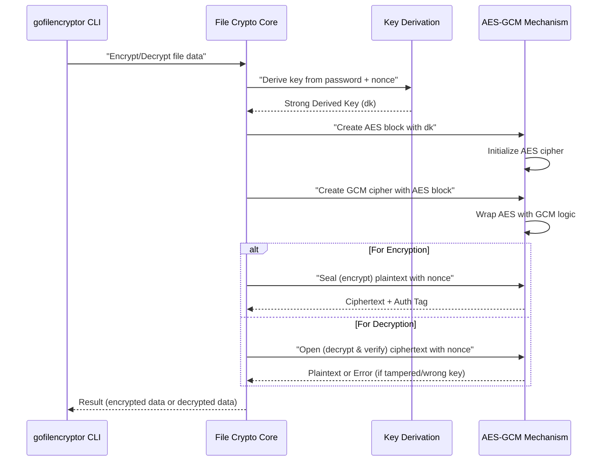

# Chapter 6: Authenticated Encryption (AES-GCM)

In the previous chapter, [Cryptographic Key Derivation](06_cryptographic_key_derivation_.md), we learned how `gofilencryptor` transforms your everyday password into a super strong, unique cryptographic key. Now that we have this incredibly powerful key, we need a special, high-tech way to use it to truly protect your files.

Our main goal in this chapter is to understand: **How does `gofilencryptor` use this strong key with an advanced method called AES-GCM to not only scramble your data but also detect if anyone has secretly tried to change it?**

### What is Authenticated Encryption (AES-GCM)?

Imagine you have a priceless treasure, and you want to put it in a safe.

*   First, you need a **strong lock** that scrambles the treasure inside, making it unreadable to anyone without the key. This is like **AES** (Advanced Encryption Standard). AES is a highly trusted algorithm designed to keep your data confidential (secret).

*   But what if someone tries to pick the lock, or even worse, subtly change the treasure *inside* the safe without you knowing? You need a **tamper-proof seal** on the safe. This seal tells you immediately if anyone has opened the safe or even touched its contents. This "tamper-proof seal" ability is provided by **GCM** (Galois/Counter Mode).

**Authenticated Encryption** (which AES-GCM is an example of) combines both: it encrypts your data (keeping it confidential) AND provides a tamper-proof seal (ensuring its integrity and authenticity). This means:

1.  **Confidentiality**: Your data is scrambled and unreadable to anyone without the correct key.
2.  **Integrity**: Even if a single character in your encrypted file is changed, `gofilencryptor` will detect it immediately when you try to decrypt it, preventing you from using corrupted or malicious data.
3.  **Authenticity**: It ensures that the data comes from the original sender and hasn't been substituted.

This makes AES-GCM a top choice for securing sensitive information because it protects against both spying (confidentiality) and tampering (integrity/authenticity).

### Key Concepts: The Two Superpowers of AES-GCM

Let's break down the two main components of AES-GCM:

| Concept           | What it Does                                                     | Why it's Important for `gofilencryptor`                                                              |
| :---------------- | :--------------------------------------------------------------- | :----------------------------------------------------------------------------------------------------- |
| **AES**           | The core "scrambling" engine. It takes your readable data and, using a secret key, turns it into unreadable gibberish (and vice versa). | This is the powerful algorithm that actually hides your file's contents from prying eyes.                |
| **GCM**           | A special "mode" of operation that adds **authentication** to AES. It generates a unique "tag" or "seal" for the encrypted data.      | This "seal" detects *any* changes to your encrypted file. If the file is altered, even slightly, `gofilencryptor` will know and refuse to decrypt it, protecting you from malicious modifications. |
| **Nonce**         | A "Number Used Once." A unique, random set of bytes generated for each encryption. You saw this in Chapter 5.                               | For AES-GCM, the Nonce is crucial. It ensures that even if you encrypt the exact same file with the exact same password multiple times, the encrypted output will always be different. This adds a vital layer of security. |

### How `gofilencryptor` Uses AES-GCM

As a user, you don't directly interact with AES-GCM. It's the powerful, hidden engine deep inside `gofilencryptor` that does the heavy lifting.

When you run `gofilencryptor` to `encrypt` a file:

1.  `gofilencryptor` first reads your file (plaintext) and securely gets your password.
2.  It then uses [Cryptographic Key Derivation](05_cryptographic_key_derivation_.md) to turn your password into a strong encryption key (`dk`).
3.  It generates a unique `nonce` for this specific encryption.
4.  Finally, it passes the plaintext, the derived key, and the nonce to the **AES-GCM mechanism**. This mechanism then scrambles the plaintext and creates the tamper-proof seal.
5.  The encrypted data (with the seal and nonce attached) is then saved back to your file.

When you run `gofilencryptor` to `decrypt` a file:

1.  `gofilencryptor` reads the encrypted file (ciphertext).
2.  It extracts the `nonce` that was saved with the encrypted data.
3.  It uses your password and this extracted `nonce` to derive the *exact same* key (`dk`) that was used for encryption.
4.  It passes the ciphertext, the derived key, and the nonce to the **AES-GCM mechanism**. This mechanism tries to unscramble the data *and* verify the tamper-proof seal.
5.  If the seal is perfect (meaning no tampering occurred and the correct key/nonce was used), the data is decrypted back to plaintext and saved. If the seal is broken (tampering, wrong password, or wrong nonce), the decryption fails, protecting you from bad data.

### How AES-GCM Works Internally

Let's look at the simplified internal process when `gofilencryptor` uses AES-GCM for encryption and decryption.



#### Peeking into the Code (`filecrypt/filecrypt.go`)

The actual cryptographic operations happen in the `Encrypt` and `Decrypt` functions within `filecrypt/filecrypt.go`.

**1. Preparing AES and GCM (in both `Encrypt` and `Decrypt` functions)**

After the `dk` (derived key) is created (as seen in [Cryptographic Key Derivation](05_cryptographic_key_derivation__.md)), `gofilencryptor` sets up the AES and GCM parts.

```go
// From filecrypt/filecrypt.go (inside Encrypt/Decrypt functions, simplified)

import (
	"crypto/aes"    // For the AES encryption algorithm
	"crypto/cipher" // For advanced encryption modes like GCM
	// ... other imports ...
)

// Assume 'dk' (your derived key) is available here.

// 1. Create the AES "lock" (block cipher) using the derived key.
// 'aes.NewCipher' prepares the AES algorithm to use your specific 'dk'.
block, err := aes.NewCipher(dk)
if err != nil {
	panic(err.Error()) // Handle error if AES cipher cannot be created
}

// 2. Prepare the AES-GCM mechanism.
// 'cipher.NewGCM' takes the AES 'block' and adds the GCM superpowers
// (confidentiality + integrity/authenticity).
aesgcm, err := cipher.NewGCM(block)
if err != nil {
	panic(err.Error()) // Handle error if GCM cannot be initialized
}

// Now, 'aesgcm' is ready to encrypt and authenticate, or decrypt and verify!
```

*   `aes.NewCipher(dk)`: This line creates an AES cipher, which is the actual engine that scrambles and unscrambles data. It needs your `dk` (derived key) to know how to do this.
*   `cipher.NewGCM(block)`: This is where GCM comes into play. It takes the AES cipher (`block`) and wraps it with the GCM mode. This `aesgcm` object is now capable of both encrypting/decrypting *and* creating/verifying the tamper-proof seal.

**2. Performing Encryption and Authentication (`aesgcm.Seal`)**

This happens inside the `Encrypt` function.

```go
// From filecrypt/filecrypt.go (inside Encrypt function, simplified)

// Assume 'plaintext' (your original file data), 'nonce', and 'aesgcm' are available.

// 'aesgcm.Seal' is the magic function for encryption AND authentication.
// - The first 'nil' means we don't pre-allocate space for output.
// - 'nonce' is the unique number for this encryption.
// - 'plaintext' is the data to encrypt.
// - The last 'nil' is for optional "Additional Authenticated Data" (AAD),
//   which 'gofilencryptor' doesn't use, keeping it simple.
ciphertext := aesgcm.Seal(nil, nonce, plaintext, nil) 

// 'ciphertext' now contains your scrambled data AND the tamper-proof seal.
// Remember, the 'nonce' is then appended to this 'ciphertext' for later decryption.
// (This was shown in Chapter 5.)
```

*   `aesgcm.Seal(...)`: This function performs the core authenticated encryption. It takes your `plaintext`, uses the `nonce` and the `aesgcm` object (which holds your `dk`) to:
    1.  Scramble the `plaintext` into `ciphertext` (confidentiality).
    2.  Compute a unique **authentication tag** (the "tamper-proof seal") based on the `plaintext`, `nonce`, and `dk`. This tag is automatically added to the `ciphertext` it returns.

**3. Performing Decryption and Verification (`aesgcm.Open`)**

This happens inside the `Decrypt` function.

```go
// From filecrypt/filecrypt.go (inside Decrypt function, simplified)

// Assume 'ciphertext' (encrypted data), 'nonce', and 'aesgcm' are available.
// 'ciphertext[:len(ciphertext)-12]' is the actual encrypted data (without the appended nonce).

// 'aesgcm.Open' is the magic function for decryption AND verification.
// - The first 'nil' means we don't pre-allocate space for output.
// - 'nonce' is the unique number extracted from the file.
// - 'ciphertext[:len(ciphertext)-12]' is the encrypted data to decrypt and verify.
// - The last 'nil' is for optional AAD (not used by 'gofilencryptor').
plaintext, err := aesgcm.Open(nil, nonce, ciphertext[:len(ciphertext)-12], nil)
if err != nil {
	// THIS IS CRUCIAL!
	// If 'err' is not nil here, it means one of three things:
	// 1. The password was wrong (which means the derived key was wrong).
	// 2. The nonce was wrong.
	// 3. The encrypted file (ciphertext) was tampered with, and the seal is broken!
	panic(err.Error()) // 'gofilencryptor' stops and reports the error.
}

// If no error, 'plaintext' contains your original, unscrambled data.
```

*   `aesgcm.Open(...)`: This function is the opposite of `Seal`. It takes the `ciphertext` and the `nonce`, and tries to:
    1.  **Verify the authentication tag** (the "tamper-proof seal") that was created during encryption. If this tag doesn't match the one computed during decryption (meaning the data was altered, or the wrong key/nonce was used), it immediately returns an error. This is the **authentication** part!
    2.  If the tag is valid, it then successfully unscrambles the data back into `plaintext` (confidentiality).

This `aesgcm.Open` function is the core of `gofilencryptor`'s security. It's not just decrypting; it's also acting as a gatekeeper, loudly complaining if anything looks suspicious.

### Conclusion

In this chapter, we've explored **Authenticated Encryption (AES-GCM)**, the highly secure method at the heart of `gofilencryptor`'s protection. You now understand that AES-GCM acts like a special safe with both a strong lock (AES, for confidentiality) and a tamper-proof seal (GCM, for integrity and authenticity). This powerful combination ensures that your files are not only kept secret but also protected from any unauthorized changes, alerting you instantly if tampering occurs.

In the next chapter, [Chapter 7: Application Packaging with Docker](07_application_packaging__docker__.md), we will explore how `gofilencryptor` can be packaged and deployed using Docker. 

---
