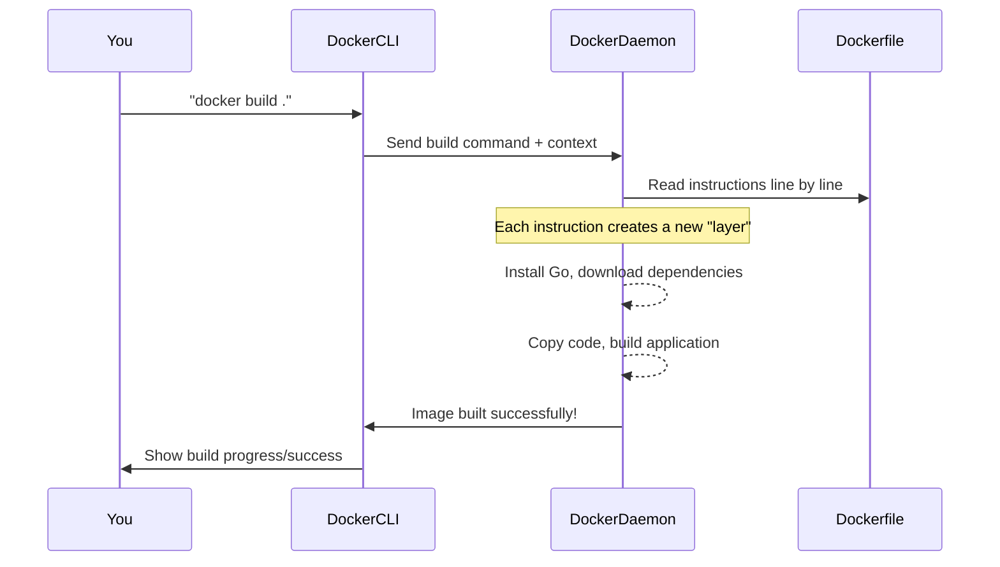

# Chapter 7: Application Packaging (Docker)

Imagine you've just built a fantastic tool like `gofilencryptor` that can encrypt and decrypt your important files. You want to share it with a friend, but there's a problem: your friend might not have the right programming language (Go, in this case) installed, or they might struggle with setting up all the necessary parts for the tool to work. It's like trying to share a fancy coffee machine, but your friend also needs to build the kitchen and plumbing first!

This is where **Application Packaging** comes to the rescue, and a tool called **Docker** is a superhero for this. Docker helps you bundle your entire application, including all its code and any special ingredients (dependencies) it needs, into a neat, self-contained package. Think of it as creating a "ready-to-use" kit for your `gofilencryptor` tool. Once packaged, anyone with Docker installed can run your tool instantly, without needing to manually set up a complex programming environment.

Our main goal in this chapter is to understand: **How can we easily share and run `gofilencryptor` on any computer, ensuring it works exactly the same way every time?**

### What is Docker? (Simplified!)

At its core, Docker is a tool that allows you to:

1.  **Package your application**: Put all its bits and pieces together.
2.  **Ship it anywhere**: Move that package easily between computers.
3.  **Run it consistently**: Ensure it works the same way, no matter where it's run.

Let's look at the key concepts:

*   **Docker Image**: This is like a **blueprint** or a **template** of your application. It contains your code, libraries, settings, and everything needed to run your app. Once you build an image, it's a fixed snapshot. You can share this blueprint with others.
*   **Docker Container**: This is a **running instance** of a Docker Image. If an image is a blueprint for a house, a container is the actual house built from that blueprint. You can start, stop, move, or delete containers without affecting the blueprint (the image).
*   **Dockerfile**: This is a simple **text file with instructions** that tell Docker how to build your image. It's like a recipe for making your "ready-to-use" kit.

### Using Docker for `gofilencryptor`

Let's see how we use Docker to package and run `gofilencryptor`.

#### Step 1: Building the Docker Image

To create our `gofilencryptor` "ready-to-use" kit, we first need to build its Docker Image. This process reads the instructions from a special file called `Dockerfile`.

Open your terminal (command prompt) and navigate to the `gofilencryptor` project folder. Then, run this command:

```sh
docker build -t go-file-encryptor .
```

Let's break down this command:

*   `docker build`: This tells Docker to create an image.
*   `-t go-file-encryptor`: This assigns a "tag" or a name to our image, making it easy to identify later. We're calling it `go-file-encryptor`.
*   `.`: This tells Docker to look for the `Dockerfile` in the current folder.

When you run this, Docker will go through the `Dockerfile` instructions and create your image. You'll see various steps being processed in your terminal as the image is built.

#### Step 2: Running the Docker Container

Once the image is built, you can now run your `gofilencryptor` tool inside a Docker Container! This means you can use its features without installing Go or any specific dependencies on your computer.

Imagine you want to encrypt a file named `my_secret_doc.txt` located in a folder like `/Users/yourname/Documents/Secrets` on your computer. Here's how you'd run `gofilencryptor` using Docker:

```sh
docker run -v /Users/yourname/Documents/Secrets:/app/files \
  go-file-encryptor encrypt /app/files/my_secret_doc.txt
```

Let's decode this powerful command:

*   `docker run`: This tells Docker to start a new container from an image.
*   `-v /Users/yourname/Documents/Secrets:/app/files`: This is super important! It's like creating a "bridge" between a folder on your actual computer (`/Users/yourname/Documents/Secrets`) and a folder *inside* the Docker container (`/app/files`). This allows `gofilencryptor` (which runs inside the container) to see and access your files on your computer. **Remember to replace `/Users/yourname/Documents/Secrets` with the actual path to your files!**
*   `go-file-encryptor`: This is the name of the image we want to run.
*   `encrypt /app/files/my_secret_doc.txt`: These are the commands that `gofilencryptor` will execute *inside* the container. It tells our tool to encrypt `my_secret_doc.txt` which it finds in its internal `/app/files` folder (thanks to our "bridge").

This single command allows you to run your encryption tool, interacting with your local files, all without messy setups!

### How Docker Works Internally

When you run `docker build` or `docker run`, a lot happens behind the scenes. Let's simplify the process of building an image first.

#### Building an Image: A Step-by-Step Walkthrough

When you type `docker build`, here's a simplified sequence of events:



Each step in the `Dockerfile` creates a "layer" in the image. Think of layers as transparent sheets stacked on top of each other. Each layer adds something new (like a programming language, dependencies, or your actual code) without modifying the layers below. This makes images efficient and reusable.

#### Peeking Inside the Dockerfile

Let's look at the `Dockerfile` provided with `gofilencryptor`. This file contains the precise instructions Docker follows to create your image.

```dockerfile
# Start from the latest golang base image
FROM golang:latest
```
*   `FROM golang:latest`: This is the very first instruction. It tells Docker to start with a pre-made "base image" that already has the Go programming language installed. It's like saying, "Start with a house that already has a basic foundation and walls."

```dockerfile
# Set the Current Working Directory inside the container
WORKDIR /app
```
*   `WORKDIR /app`: This sets the main working folder *inside* our container to `/app`. All subsequent commands will run from this directory within the container.

```dockerfile
# Copy go mod and sum files
COPY go.mod go.sum ./

# Download all dependencies. Dependencies will be cached if not changed
RUN go mod download
```
*   `COPY go.mod go.sum ./`: These files describe our project's Go dependencies. We copy them first.
*   `RUN go mod download`: This command then tells Docker to execute `go mod download` *inside* the container. This downloads all the necessary external libraries that `gofilencryptor` needs to function. Docker is smart: if these files don't change, it won't download them again, making future builds faster!

```dockerfile
# Copy the source from the current directory to the Working Directory
COPY . .
```
*   `COPY . .`: This copies all the remaining files from your current project folder (where your `Dockerfile` is) into the `/app` folder inside the container. This includes your actual Go source code (`main.go` and others).

```dockerfile
# Build the Go app
RUN go build -o main .
```
*   `RUN go build -o main .`: This command compiles your Go source code into a single executable file named `main`. This is the actual `gofilencryptor` program!

```dockerfile
# Command to run the executable when container starts
CMD ["./main"]
```
*   `CMD ["./main"]`: This specifies the default command that will be run when you start a container from this image. In our case, it's `./main`, which launches our compiled `gofilencryptor` tool. When you add arguments like `encrypt /app/files/file.txt` to `docker run`, these arguments are passed to `./main`.

And that's the `Dockerfile`! It's a simple, step-by-step guide for Docker to create a self-contained environment for your `gofilencryptor` tool.

### Conclusion

In this final chapter, we learned about **Application Packaging with Docker**. We understood how Docker helps us create a portable, "ready-to-use" kit for our `gofilencryptor` tool, allowing it to run consistently on any machine. We explored key concepts like Images, Containers, and Dockerfiles, and saw how to build and run our `gofilencryptor` within a Docker container. Finally, we peeked into the `Dockerfile` to understand the instructions that bring our packaged application to life.

This completes our journey through the core concepts of `gofilencryptor`, from packaging it with Docker to understanding how it securely encrypts your precious data!

---
