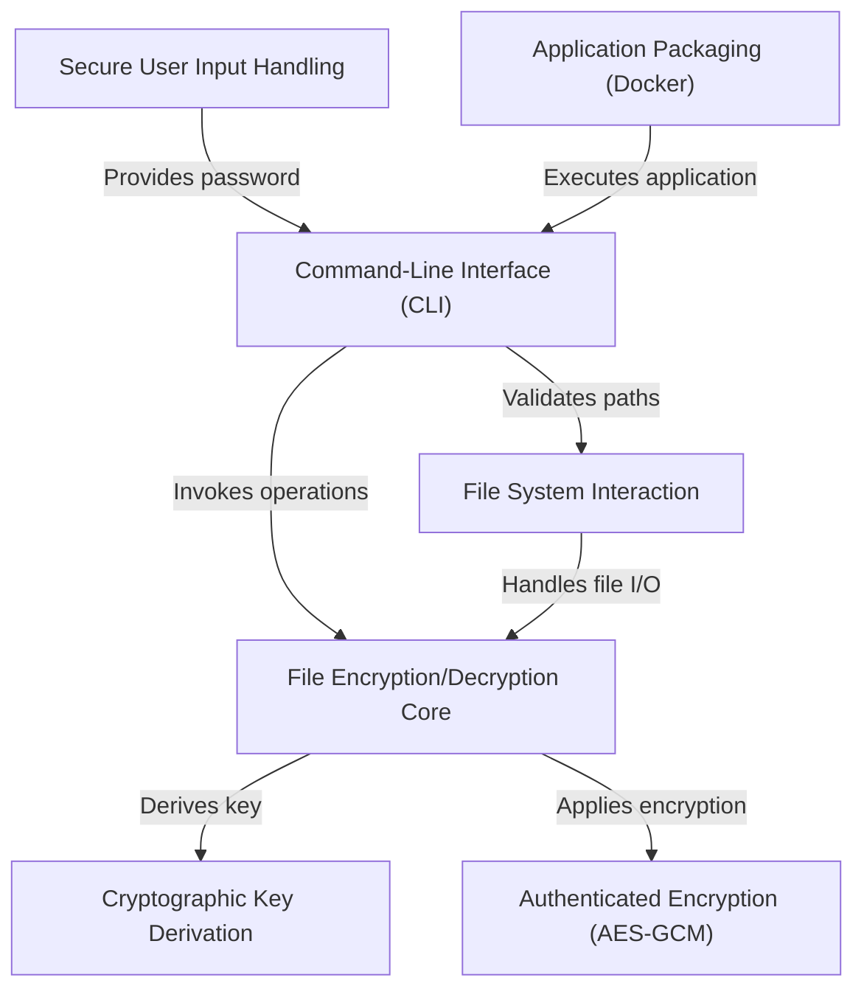

# Tutorial: gofilencryptor

This project, `gofilencryptor`, is a **simple and secure tool** designed to *protect your digital files*. It allows you to **encrypt** them, turning readable data into an unreadable format, and then **decrypt** them back to their original state using a password. Built with a *command-line interface*, it's easy to use and can even be run consistently across different environments thanks to *Docker*.

## Visual Overview

## Chapters

1. [Command-Line Interface (CLI)
](01_command_line_interface__cli__.md)

---
